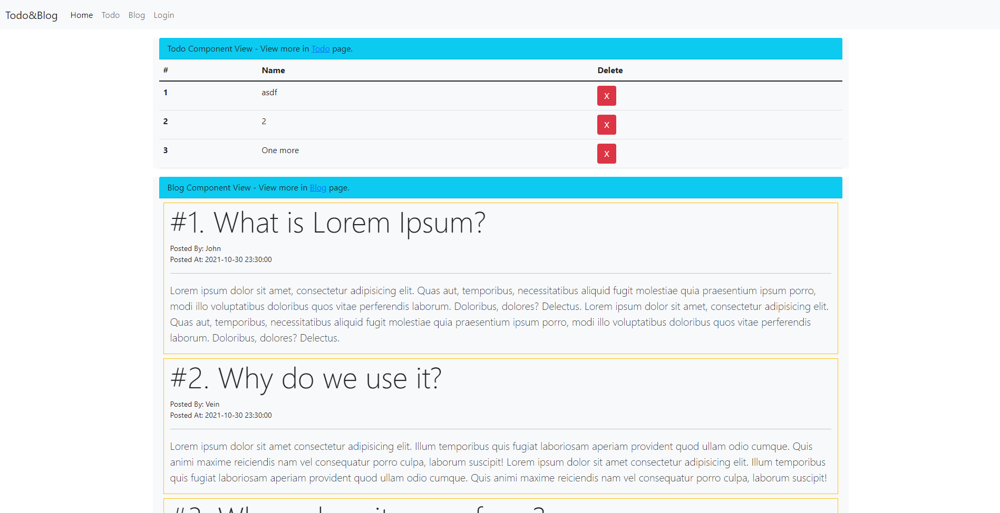

### Name: Ilyas Muhammad
### Roll. No: 2K18/CSC/06
### Web Programming Assignment (To-do List & Blog Post)
### Assignment Given by: Sir Gulsher Laghari

# Todo and Blog Application

In this assignemnt-based project, I have implemented a session based Todo and Blog application using PDO's approch.

## Salient Features

- Session based Todo App implemention.
- Blog App using PDO.
- Session based authentication mechanism.
- Only logged in users can post new blogs.
- Read blog page is set public.

Using given below credentials, one can post blog using local server, email me at <ilyasmuhammada@gmail.com> to get list of users of live server.

```php
    $users = array(
        array("user" => "user1@blog.com", "pass" => "pass1", "name" => "Johnny"),
        array("user" => "user2@blog.com", "pass" => "pass2", "name" => "Ronaldo"),
        array("user" => "user3@blog.com", "pass" => "pass3", "name" => "Messi"),
    );
```

## How to setup and run the code

Clone this repo using `git clone https://github.com/ilyasmabbasi/webprog-assignment/edit/main/README.md` in htdoc. There is a file [dbSetup.php](dbSetup.php) in root directory, which will generate a dummy database with some record to test the blog side of application. Run it on localhost using [http://localhost/todo&blog-app/dbSetup.php](http://localhost/todo&blog-app/dbSetup.php) url.

## How to run the application

- Open browser and visit [http://localhost/todo&blog-app](http://localhost/todo&blog-app) and test it on local server.
- One copy of this code is also deployed on live server at [https://todo-blog.000webhostapp.com/](https://todo-blog.000webhostapp.com/)

## Odds

- Some logical fixes are still pending to do...will fix soon.

## Screenshots

Navbar when there is a guest user.

Navbar when there is a logged-in user.

On home page there display components of Todo and Read blog are imported from [components.php](components.php) and these same components are used in [todo.php](todo.php) and [blog.php](blog.php), respectively.

On [Todo Page](todo.php) there is a add task component with display Todo component.

